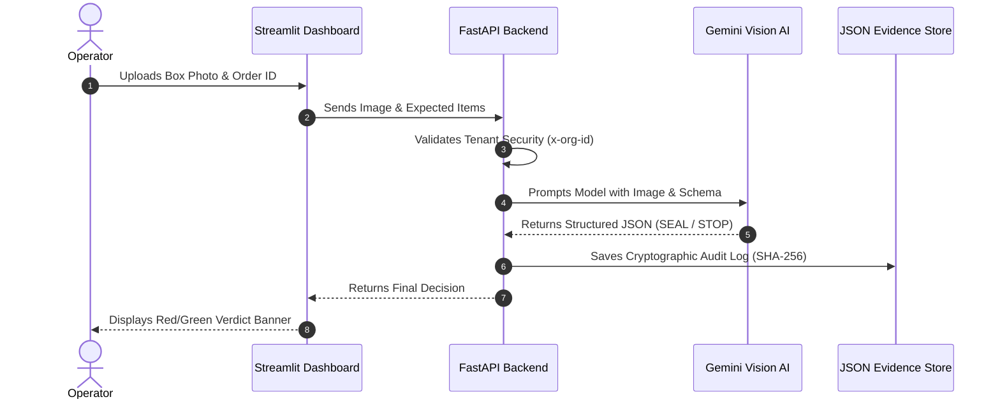

# Architecture & Tech Stack: Pack Manager AI

> **Mission:** To provide a fast, evidence-backed, and fail-safe AI packaging verification system for 3PLs.

## 🛠️ The Tech Stack

- **Frontend:** Streamlit (Python) - Chosen for rapid prototyping of operator-facing dashboards.
- **Backend API:** FastAPI (Async Python) - Chosen for high throughput image uploads and low latency routing.
- **AI Vision Engine:** Google Gemini Flash Lite - Chosen for its ultra-fast vision inference and ability to return strict JSON schemas.
- **Data Modeling:** Pydantic - Chosen to force the AI to output booleans (e.g. `all_items_present`) rather than hallucinated text.
- **Evidence Store:** Local JSON Contracts & SHA256 Hashing - File-based audit trails.

---

## 📊 Broad Architecture Flow
We designed the system to be strictly decoupled. The operator tablet (Frontend) never talks to the AI directly. It must pass through the FastAPI backend which enforces security and business rules.

## ⚙️ Engineering Design Decisions

### 1. The "Fail-Open" Network Rule
Warehouse assembly lines cost thousands of dollars a minute when stalled. If Google's API goes down, or the warehouse Wi-Fi drops, the AI **must not** crash the workflow. 
* **How we built it:** The FastAPI route wraps the AI call in a timeout/catch block. If it fails, it gracefully returns `PENDING (Fail Open)` to the frontend, allowing the operator to manually seal the box and keep the line moving.

### 2. Tenancy Isolation (3PL Security)
This is built for Third Party Logistics (3PL) companies who pack boxes for MULTIPLE different brands (tenants) in the same building. 
* **How we built it:** Every single API request must contain an `x-org-id` header. The backend enforces Row-Level Security (RLS) by tieing every audit record to this ID. An operator authenticated for `alpha` cannot access package evidence for `bravo`.

### 3. Cryptographic Evidence Contracts
Customers often lie about "missing items" for refunds. The system doesn't just make a decision; it generates a legally traceable receipt. 
* **How we built it:** For every image processed, the FastAPI backend generates a SHA256 hash of the JPEG bytes. It saves a strict JSON record (containing the operator ID, what was expected, what was found, and the hash) to a fixed `contract/` folder.

### 4. Decision Logic & Verdict Generation
The system employs a strict deterministic rules engine on top of the Vision AI's output. The VLM must output three booleans (`all_items_present`, `quantities_correct`, `no_extra_items`). 
* **SEAL:** Triggered *only* if all three booleans evaluate to `True`.
* **STOP & FIX:** Triggered if *any* boolean evaluates to `False`.
* **UNCERTAIN:** Triggered safely if the VLM cannot confidently see the items (e.g. extreme occlusion). This safely routes the box to a human reviewer.
